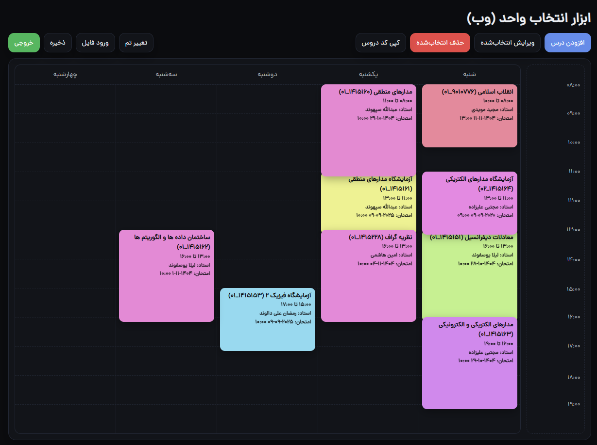
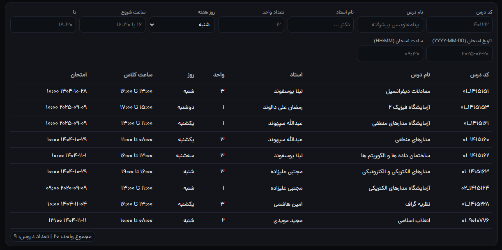

# 🚀 برنامه ریز انتخاب واحد

آقا یه ابزار ساده و باحال تحت وب، که موقع انتخاب واحد کارتو راه بندازه و حرص نخوری. خیلی شیک و مجلسی درستش کردم که بتونی برنامه‌تو بچینی، ببینی تداخل داره یا نه و آخرش یه برنامه هفتگی خوشگل تحویل بگیری. 😎

کل داستان روی مرورگر خودت اتفاق میفته، یعنی هیچ اطلاعاتی جایی نمیره. همه چی امن و امان رو سیستم خودته. خیالت تخت!

---

## ✨ چی کارا بلده؟

* **مدیریت درسا**: خیلی راحت هر درسی رو با مشخصاتش اضافه، ویرایش یا حذف کن.
* **برنامه گرافیکی**: برنامه‌تو تو یه جدول زمانی خوشگل ببین که بفهمی چی به چیه.
* 🎨 **تم دارک و لایت**: دو تا تم خفن داره که چشات اذیت نشه و حال کنی باهاش.
* **تشخیص تداخل**: خودش حواسش هست که کلاسات یا امتحاناتت با هم تداخل نداشته باشن و بهت میگه.
* 💾 **ذخیره و بازیابی**: میتونی کل برنامه‌تو یه فایل `JSON` بکنی، ذخیره‌ش کنی و بعداً دوباره بیاریش بالا.
* **خروجی PDF و عکس**: از برنامه‌ت با فرمت‌های **PDF**، **PNG** و **JPEG** خروجی بگیر و بفرست واسه دوستات پز بدی.
* **کپی کد درسا**: با یه دکمه، کد همه درساتو کپی کن که راحت تو سایت دانشگاه وارد کنی.
* **جمع واحدها**: خودش واست جمع میزنه که چند واحد برداشتی و چند تا درس داری.

---

## 🚀 چجوری راش بندازم؟

هیچی! کاری نداره اصلاً. چون نیازی به نصب و سرور و این داستانا نداره.

1.  کل پروژه رو از گیت‌هاب دانلود کن (یه فایل ZIP بهت میده).
2.  از حالت فشرده خارجش کن.
3.  فایل `index.html` رو پیدا کن و بکِش بنداز تو مرورگرت (کروم، فایرفاکس، هرچی که داری).
4.  تموم! برو حالشو ببر و برنامه‌تو بچین.

---

## 🤝 پایه ای کمک کنی؟

دمت گرم میشم اگه کمک کنی! این پروژه اوپن سورسه و هر کی دوست داشته باشه میتونه خفن‌ترش کنه.

اگه ایده باحالی داری، یا یه باگی چیزی پیدا کردی، حتماً یه **Issue** تو گیت‌هاب باز کن. اگه خودت کدی زدی که بهترش میکنه، یه **Pull Request** بفرست، با کمال میل بررسی می‌کنم. حتی اگه یه غلط املایی هم پیدا کردی، دریغ نکن! ❤️